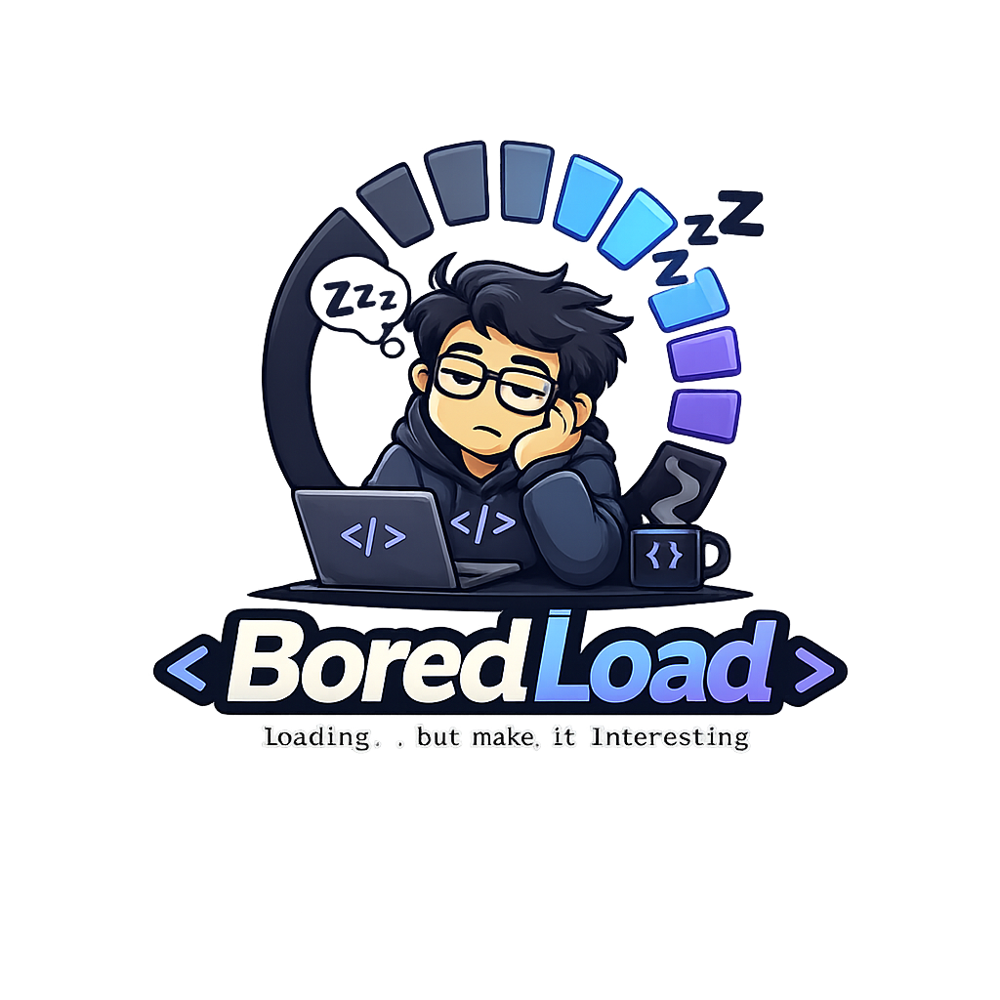
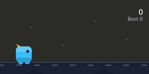

<p align="center">
  
</p>

[](https://www.npmjs.com/package/boredload)
[](https://www.npmjs.com/package/boredload)
[](./LICENSE)
[](https://github.com/salamancacm/boredload/actions/workflows/ci.yml)
[](https://ko-fi.com/salamancacm)

**A tiny Canvas 2D minigame you show during loading states — instead of a boring spinner.**



## Why boredload

Spinners are dead time. If a loading state takes long enough for a user to notice, it's long
enough for them to play a few seconds of a tiny game instead of watching a circle spin.
boredload swaps in a minimal, original geometric runner game once your loading state crosses a
configurable threshold — and instead of yanking it away the instant loading finishes, it lets the
player keep playing (to see how far they get) until they choose to continue or a safety timeout
kicks in.

- **Framework-agnostic core.** Pure TypeScript, Canvas 2D, zero runtime dependencies.
- **Optional React wrapper.** `boredload/react` gives you a hook and a drop-in component.
- **Optional Angular wrapper.** `boredload/angular` gives you a standalone `[boredload]` directive.
- **Tiny.** Core bundle stays under 15kb gzip.
- **Player-controlled exit.** The game doesn't vanish the moment loading ends — a "Continue"
  affordance appears once it's safe to leave, and the player decides when to use it.
- **Configurable.** Threshold, minimum/maximum play time, theme, seed, and your own games via a
  simple registry.
- **Framework-friendly.** Works in Next.js App Router, Angular, Vite, and plain HTML/TS.

## Features

- Canvas 2D dino-runner-style minigame (original visuals — not a Chrome clone)
- Keyboard (Space / ArrowUp) and touch/pointer input, with press-to-retry on game over
- DPR-aware canvas scaling
- Configurable `threshold` (delay before the game appears), `minPlayMs` (minimum time before the
  player can leave), and `maxPlayMs` (safety cap that auto-dismisses if they never do)
- A "Continue" button appears once the real loading is done and `minPlayMs` has elapsed — the
  player keeps playing until they click it, lose, or `maxPlayMs` runs out
- Deterministic obstacle generation via a seeded PRNG (great for tests/demos)
- Themeable colors, with automatic theming from your own CSS custom properties
- Persisted high score across sessions (`localStorage`), shown in-game as "Best"
- Respects `prefers-reduced-motion` by default — never forces an animated game on users who opted out
- Optional adaptive threshold that shows the game sooner on a confirmed-slow connection
- Extensible `Game` interface + registry for building your own minigame
- `'use client'` on all React entry points — safe to import in Next.js App Router

## Install

```bash
npm install boredload
```

## Quick Start

### Vanilla TypeScript

```ts
import { mount } from 'boredload';

const container = document.getElementById('loading-slot')!;
const game = mount(container, {
  threshold: 1500,
  minPlayMs: 3000,
  maxPlayMs: 30000,
  onExit: () => {
    // real content is ready and the player has left the game — show it now.
  },
});

game.setLoading(true);

fetchSomething().then(() => {
  game.setLoading(false);
  // the game keeps running — a "Continue" button appears once minPlayMs has
  // elapsed, and the player decides when to click it (or it auto-dismisses
  // after maxPlayMs).
});
```

### React

```tsx
import { useState } from 'react';
import { LoadingGame } from 'boredload/react';

function DataPanel() {
  const { data, isLoading } = useData();
  const [dismissed, setDismissed] = useState(false);

  return (
    <div>
      <LoadingGame
        isLoading={isLoading}
        width={320}
        height={160}
        onExit={() => setDismissed(true)}
      />
      {!isLoading && dismissed && <Results data={data} />}
    </div>
  );
}
```

Note the two-part gate: `!isLoading` alone isn't enough to reveal your real content, because the
game may still be showing (the player is allowed to keep playing). Wait for `onExit` too — or, if
you'd rather the game stay purely decorative and never delay your content, render `<Results>`
based on `!isLoading` alone and let `<LoadingGame>` overlay/hide itself independently.

### Angular

```html
<div
  boredload
  [isLoading]="isLoading()"
  [width]="320"
  [height]="160"
  (exit)="dismissed.set(true)"
></div>
```

```ts
import { Component, signal } from '@angular/core';
import { BoredloadGameDirective } from 'boredload/angular';

@Component({
  selector: 'app-data-panel',
  standalone: true,
  imports: [BoredloadGameDirective],
  templateUrl: './data-panel.html',
})
export class DataPanel {
  protected readonly isLoading = signal(true);
  protected readonly dismissed = signal(false);
}
```

`BoredloadGameDirective` is an attribute directive — attach it to any host element and it becomes
the loading widget, same two-part `isLoading`/`exit` gate as the React example above. All
`GameConfig` options are available as `@Input()`s (`threshold`, `minPlayMs`, `theme`, etc.), and
`gameOver`/`readyToContinue`/`exit` are `@Output()`s.

## Framework Guides

### Next.js (App Router)

`LoadingGame` and `useLoadingGame` both start with `'use client'`, so they can be imported
directly into a Client Component:

```tsx
'use client';

import { LoadingGame } from 'boredload/react';

export function LoadingSlot({ isLoading }: { isLoading: boolean }) {
  return <LoadingGame isLoading={isLoading} />;
}
```

Import them only from a file that is (or is rendered inside) a Client Component boundary.

### Vite

Works out of the box with `boredload` and `boredload/react` — no special configuration needed.

### Vanilla / no bundler

Use the `mount()` helper directly against any DOM element; see the Quick Start above.

### Angular

Works with a standard `ng build`/`ng serve` (Angular CLI ≥15, tested against the newer esbuild
Vite-based dev server too). `BoredloadGameDirective` is `standalone: true`, so just add it to your
component's `imports` array — no `NgModule` needed. See the Angular section above.

## API Reference

### `mount(container, options?) => MountHandle`

```ts
interface MountOptions extends GameConfig {
  width?: number;
  height?: number;
}

interface MountHandle {
  setLoading(isLoading: boolean): void;
  destroy(): void;
  getScore(): number;
}
```

### `GameEngine`

```ts
class GameEngine {
  constructor(options: GameEngineOptions);
  start(): void;
  stop(): void;
  destroy(): void; // idempotent
  resize(width: number, height: number): void;
  setTheme(theme: Partial<Theme>): void;
  getScore(): number;
}
```

### `GameConfig`

| Option               | Type                      | Default           | Description                                                                 |
| -------------------- | ------------------------- | ------------------ | ---------------------------------------------------------------------------- |
| `game`                | `string`                  | `'dino-runner'`    | Registered game id                                                          |
| `threshold`           | `number`                  | `1500`             | Ms of loading before the game appears                                      |
| `minPlayMs`           | `number`                  | `3000`             | Ms the game must stay visible (from when it appeared) before the player can leave |
| `maxPlayMs`           | `number`                  | `30000`            | Ms the "Continue" affordance waits for a manual click before auto-dismissing |
| `continueLabel`       | `string`                  | `'Continue →'`     | Label for the manual continue button (fully custom text/locale — your call) |
| `onGameOver`          | `(score: number) => void` | —                  | Called with the score at the moment the game is dismissed                  |
| `onReadyToContinue`   | `() => void`              | —                  | Called once the "Continue" affordance becomes available                    |
| `onExit`              | `() => void`              | —                  | Called when the game is dismissed (manual click or `maxPlayMs` timeout)    |
| `theme`               | `Partial<Theme>`          | —                  | Color overrides — takes precedence over auto-detected CSS vars             |
| `seed`                | `number`                  | `Date.now()`       | PRNG seed for deterministic obstacle spawning                              |
| `persistHighScore`    | `boolean`                 | `true`             | Persist the best score across sessions via `localStorage`                  |
| `highScoreKey`        | `string`                  | `` `boredload:${game}` `` | Storage key for the persisted high score                            |
| `respectReducedMotion`| `boolean`                 | `true`             | Never show the game (stay in spinner mode) when the OS/browser requests reduced motion |
| `adaptiveThreshold`   | `boolean`                 | `false`            | Opt in to a shorter `threshold` on a confirmed-slow connection             |
| `slowConnectionThresholdMs` | `number`            | `500`              | Threshold used instead of `threshold` when `adaptiveThreshold` detects a slow connection |

### `LoadingGameProps` (React)

`GameConfig & { isLoading: boolean; width?: number; height?: number; className?: string }`

### `BoredloadGameDirective` (Angular, `boredload/angular`)

Attribute directive, selector `[boredload]`. Every `GameConfig` field is an `@Input()` of the same
name, plus `isLoading` (required), `width`, `height`. Outputs: `gameOver` (`number`),
`readyToContinue` (`void`), `exit` (`void`). Also exposes `getScore()`/`getHighScore()` methods if
you grab a template reference to the host directive.

### `useLoadingGame(isLoading, config?) => { canvasRef, showGame, readyToContinue, score, highScore, dismiss }`

Lower-level hook if you want to build your own presentation around the canvas. `dismiss()` is what
a custom "Continue" button should call; `readyToContinue` tells you when it's safe to show one;
`highScore` is the persisted best score, updated once the current run ends.

### Accessibility & network awareness

- **Reduced motion**: if the user's OS/browser requests `prefers-reduced-motion: reduce`, boredload
  never shows the canvas game — it stays in accessible spinner mode for the whole loading state.
  Set `respectReducedMotion: false` if you want the game to show regardless (not recommended).
- **Adaptive threshold**: `adaptiveThreshold: true` checks the (Chromium-only) Network Information
  API — if it reports a confirmed slow connection (`slow-2g`/`2g`), the game appears almost
  immediately (`slowConnectionThresholdMs`, default 500ms) instead of waiting for `threshold`. It's
  a no-op wherever the API is unavailable (Safari, Firefox) — boredload never *guesses* a
  connection is fast, only acts when it's confirmed slow.

### Styling hooks

Both `mount()` and `<LoadingGame />` render the same structure: a `.boredload-stage` wrapper
containing `.boredload-canvas` (or `.boredload-spinner` while waiting) and, once available,
`.boredload-continue` — laid out in normal flow *below* the canvas, never overlapping the game
area. Target these classes from your own CSS to restyle them; the button's label is controlled via
`continueLabel` (see `GameConfig` above).

## Theming

```ts
interface Theme {
  background: string;
  ground: string;
  player: string;
  obstacle: string;
  text: string;
  accent: string;
}
```

Pass any subset via `theme` in `GameConfig` / `LoadingGameProps`.

### Auto-theming from CSS

You don't have to pass `theme` at all — boredload reads `--boredload-*` custom properties from the
element it mounts into (and its ancestors, since custom properties inherit), so it can pick up your
site's colors automatically:

```css
:root {
  --boredload-background: #0f172a;
  --boredload-player: #38bdf8;
  --boredload-obstacle: #f472b6;
  --boredload-accent: #facc15;
}
```

Precedence: explicit `theme` prop > `--boredload-*` CSS vars > built-in default theme.

## Building Your Own Game

boredload's engine is decoupled from the dino-runner — implement the `Game` interface and
register it:

```ts
import { registerGame, type Game } from 'boredload';

const myGame: Game<MyState> = {
  id: 'my-game',
  init(ctx) {
    /* return initial state */
  },
  update(state, dt, input) {
    /* return next state */
  },
  render(ctx, state, viewport) {
    /* draw */
  },
  destroy(state) {
    /* cleanup */
  },
};

registerGame('my-game', () => myGame);
```

Then pass `game: 'my-game'` in your config.

## Browser Support

Any browser with Canvas 2D and `requestAnimationFrame` support — all evergreen browsers.
`ResizeObserver` is used when available, with a `window.resize` fallback.

## Testing

```bash
npm test
npm run test:coverage
```

Tests run with Vitest + jsdom, using a hand-written Canvas 2D context stub (no
`vitest-canvas-mock` dependency). Visual/pixel output is intentionally not tested.

## Contributing

See [CONTRIBUTING.md](./CONTRIBUTING.md).

## License

MIT — see [LICENSE](./LICENSE).

## Support

If boredload saved you from shipping another boring spinner, consider supporting development:

**[☕ ko-fi.com/salamancacm](https://ko-fi.com/salamancacm)**
